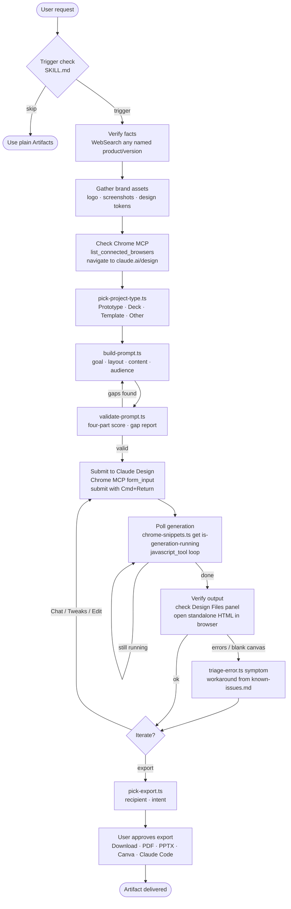

# gg-claude-designer

A Claude skill for using **Claude Design** (https://claude.ai/design) — Anthropic Labs' research-preview web tool for prototypes, slide decks, microsites, and presentations — through a Claude agent.

The skill teaches a fresh agent how to operate Claude Design end-to-end: pick the right project type, compose a well-formed prompt, drive the canvas via Chrome MCP, iterate via Chat / Comments / Tweaks / Edit, choose the right export, and triage the research-preview rough edges.

## Install

Drop this skill into a workspace as a Git submodule (recommended for pinned
versions) or a plain clone — no GG tooling required:

```bash
# Project-local, version-pinned (recommended):
git submodule add git@github.com:gabrielgiacomini/gg-claude-designer.git .claude/skills/gg-claude-designer

# OR project-local, latest main:
git -C .claude/skills clone git@github.com:gabrielgiacomini/gg-claude-designer.git

# OR user-level, available in every project on this machine:
git -C ~/.claude/skills clone git@github.com:gabrielgiacomini/gg-claude-designer.git
```

Restart Claude Code (or run `/skills reload`) to activate. See the parent
[`gg-skills` repo](https://github.com/gabrielgiacomini/gg-skills) for the
full bootstrap pattern, multi-IDE projection via `gg-ide-sync`, and the
catalog of every available skill.

## When to use

Trigger this skill when the user:

- Asks for a UI mockup, prototype, landing page, dashboard, microsite, signup flow, or settings screen that should be **shareable and exportable**.
- Mentions **"Claude Design"** by name.
- Wants output to match their brand via **design system inheritance**.
- Needs a **slide deck** exportable to PPTX or handoff to Canva.
- Wants **visual iteration** with inline comments, on-canvas tweaks, or direct property edits.
- Wants to **hand a design off to Claude Code** for implementation.
- Asks how to **set up an org-wide design system**.
- Hits a Claude Design issue (vanishing comments, save errors, "chat upstream error").

Skip when the user wants a single throwaway visual inside a chat (plain Artifacts is better) or asks about general design theory without a specific Claude Design task.

## How it operates

### Inputs

| Input | Where it comes from |
|---|---|
| User's design brief | Conversation text; structured with `build-prompt.ts` |
| Brand assets (logo, screenshots, product shots) | User-supplied files attached in Claude Design before the first prompt |
| Design system tokens | Org-level design system configured at https://claude.ai/design |
| Codebase / component library | Attached subdirectory (not the whole monorepo — see Caveats) |
| Sibling project name | Named in the prompt to inherit visual context cross-project |
| Chrome MCP connection | `mcp__Claude_in_Chrome__list_connected_browsers` → user selects which browser tab |
| `SKILL.md` + `references/*.md` | Read on demand by the agent; no env vars required |

No environment variables are required. The scripts use only Node's built-in `process.argv` — no `.env`, no secrets, no network calls.

### Outputs

| Output | Path / format | Notes |
|---|---|---|
| Assembled prompt text | stdout (plain text or `--json`) from `build-prompt.ts` | Passed to the Claude Design chat input |
| Prompt score / gap report | stdout from `validate-prompt.ts` | Lists missing four-part-formula components |
| Project type recommendation | stdout from `pick-project-type.ts` | One of: Prototype (hi-fi / wireframe), Slide deck, From template, Other |
| Export format recommendation | stdout from `pick-export.ts` | One of: PDF, PPTX, .zip, standalone HTML, Canva, Claude Code handoff |
| Model recommendation | stdout from `pick-model.ts` | Opus 4.7 for initial generation; Sonnet/Haiku for iteration |
| Error triage | stdout from `triage-error.ts` | Matched workaround from `references/known-issues.md` |
| DOM probe result | JSON from Chrome MCP `javascript_tool` | Page state: file tree, running indicator, share menu items, model list |
| Design files | Claude Design project (browser) | `.html` pages + `.jsx` components written by Claude Design on the canvas |
| Exported artifact | User's Downloads folder (user must approve) | `.zip` (~5–50 KB, instant), PDF/HTML (~5–10 min sub-generation), PPTX |

### External commands and MCPs

The agent calls these in order — local scripts first, Chrome MCP for UI actions, no other network calls:

| Command | Purpose |
|---|---|
| `npx tsx scripts/build-prompt.ts --goal … --layout … --content … --audience …` | Assemble a well-formed four-part prompt |
| `npx tsx scripts/validate-prompt.ts "<prompt>"` | Score a user-supplied prompt; surface gaps before submission |
| `npx tsx scripts/pick-project-type.ts --deliverable "…"` | Recommend picker tab |
| `npx tsx scripts/pick-export.ts --recipient "…" --intent "…"` | Recommend Share-menu export |
| `npx tsx scripts/pick-model.ts --phase iterate --complexity simple --cost low` | Recommend model by phase |
| `npx tsx scripts/triage-error.ts "<symptom>"` | Match symptom → documented workaround before asking the user |
| `npx tsx scripts/chrome-snippets.ts get <name>` | Retrieve a named JS snippet for injection |
| `mcp__Claude_in_Chrome__javascript_tool` | Execute the JS snippet in the connected browser tab |
| `mcp__Claude_in_Chrome__navigate` | Open https://claude.ai/design (or a project URL) |
| `mcp__Claude_in_Chrome__find` / `form_input` / `shortcuts_execute` | Type into the chat input; submit with `⌘+Return` |
| `mcp__Claude_in_Chrome__read_page` / `get_page_text` | Read canvas or project state |

All TypeScript scripts are pure-logic — they take CLI input, run a decision tree, and emit JSON or human-readable text. No network, no Chrome MCP calls from within the scripts.

### Side effects

- **Browser navigation:** the agent opens and drives the Claude Design web app in a connected Chrome tab. The user must have a tab open and logged in at claude.ai.
- **Canvas writes:** Claude Design writes `.html` pages and `.jsx` components into the project on every generation. These live in Claude Design's cloud storage, not on the local filesystem.
- **Downloads:** the agent must ask the user to approve before triggering any download. The user clicks "Download project as .zip" or approves an export; the file lands in the browser's default download folder.
- **Sharing/access changes:** the agent must never toggle access controls or sharing permissions autonomously. Confirm with the user first.
- **Model picker:** the agent may read the model dropdown via `chrome-snippets.ts get list-models` but does not switch models without user awareness.

### Mode toggles

| Flag | Effect |
|---|---|
| `--json` (any script) | Machine-parseable JSON instead of human-readable text |
| `--variations one` | `build-prompt.ts` appends "Just give me a single design — no variations." |
| `--design-system off` | Omits the design system token line from the assembled prompt |
| `--mode dark` | Adds dark-mode aesthetic to the prompt |
| `--device mobile` | Appends mobile-width constraint |

## Operational flow



## Layout

```
.
├── SKILL.md                              ← entry point, with YAML frontmatter
├── references/                           ← topic docs the skill loads on demand
│   ├── overview.md                    ← what Claude Design is, who it's for, models
│   ├── ui-and-workflows.md            ← picker, project view, every project type
│   ├── prompting-and-iteration.md     ← Chat vs. Comments vs. Tweaks vs. Edit
│   ├── exports-and-sharing.md         ← Share menu, three export categories
│   ├── design-systems-and-pricing.md  ← design system setup, plan allowances
│   ├── known-issues.md                ← research-preview bugs and workarounds
│   ├── canvas-reference.md               ← every UI control catalogued
│   ├── export-decision-guide.md          ← pick the right export format
│   └── prompt-templates.md               ← reusable prompts by use case
└── scripts/                              ← TypeScript helpers for agentic use
    ├── README.md
    ├── build-prompt.ts                   ← assemble a well-formed prompt
    ├── validate-prompt.ts                ← score a prompt against the four-part formula
    ├── pick-project-type.ts              ← Prototype / Slide deck / Template / Other
    ├── pick-export.ts                    ← which Share-menu option, given recipient
    ├── pick-model.ts                     ← which Claude model, given task phase
    ├── triage-error.ts                   ← symptom → documented workaround
    └── chrome-snippets.ts                ← JS to inject via Chrome MCP javascript_tool
```

## Quick start

```bash
# clone the skill
git clone https://github.com/gabrielgiacomini/gg-claude-designer.git ~/.claude/skills/gg-claude-designer

# assemble a prompt for a dashboard (pure local, no Chrome needed)
npx tsx ~/.claude/skills/gg-claude-designer/scripts/build-prompt.ts \
  --goal "executive dashboard" \
  --layout "3-col KPI strip on top, chart row below, table at the bottom" \
  --content "MRR, churn rate, NPS — each as a card with sparkline + delta" \
  --audience "CEO weekly review" \
  --dimensions "1440x900" \
  --palette "minimal monochrome with one warm accent" \
  --variations one

# validate a prompt the user already wrote
npx tsx ~/.claude/skills/gg-claude-designer/scripts/validate-prompt.ts "Make me a dashboard"

# pick the right export once the design is approved
npx tsx ~/.claude/skills/gg-claude-designer/scripts/pick-export.ts \
  --recipient "CEO" --intent "sign-off"
```

See [scripts/README.md](./scripts/README.md) for the full script inventory and examples.

## Resources

- [Claude Design](https://claude.ai/design) — the tool itself
- [references/overview.md](./references/overview.md) — models, plans, how it differs from Artifacts
- [references/ui-and-workflows.md](./references/ui-and-workflows.md) — picker, canvas, every project type
- [references/prompting-and-iteration.md](./references/prompting-and-iteration.md) — four-part formula, four iteration modes
- [references/exports-and-sharing.md](./references/exports-and-sharing.md) — every Share menu item
- [references/known-issues.md](./references/known-issues.md) — research-preview bugs and confirmed workarounds
- [scripts/README.md](./scripts/README.md) — all TypeScript helpers with examples

## Caveats

- **Research preview.** Claude Design is in research preview. UI surfaces, model lists, and export options will shift. Re-verify before relying on a specific detail.
- **Cmd+Return submits.** Plain Return inserts a newline. The skill harps on this for a reason.
- **Three categories of "export."** `Download project as .zip` is an instant download (~5–50 KB). `Export as PDF` and `Export as standalone HTML` are sub-Claude generations that take 5–10 minutes and produce new files in the project. `Send to Canva` and `Handoff to Claude Code` push to external tools.
- **Cross-project context.** Mention a sibling project by name in the prompt and Claude Design will read its files for visual consistency. Undocumented, but reliable.
- **Monorepos.** Attach only a component library or design-tokens subdirectory — linking an entire monorepo causes the browser to lag or hang.
- **Cowork safety rules apply** when an agent operates Claude Design on a user's behalf: downloads need explicit user approval, sharing/access changes are off-limits.

## What's been validated

The skill was built from a hands-on walk through the live tool, then exercised across four real Claude Design projects covering Chat-based iteration, Tweaks-based iteration, sibling-project context inheritance, and `.zip` exports. Findings from that exercise round-tripped back into the skill — see commit history.

## License and attribution

MIT — see [LICENSE](./LICENSE).

Substantial portions of the craft layer (fact verification, design principles, brand-asset protocol, post-render verification, named design styles) are adapted from [jiji262/claude-design-skill](https://github.com/jiji262/claude-design-skill) (also MIT). Each adapted file carries an in-place attribution footer; the full mapping is in [ATTRIBUTIONS.md](./ATTRIBUTIONS.md).

## Provenance

Built and validated on 2026-04-26 against Claude Design v(research preview), models Claude Opus 4.7 (default) / Sonnet 4.6 / Haiku 4.5 / and earlier. Cross-checked against the official help-center articles linked in [references/overview.md](./references/overview.md).

Issues, fixes, and prompt-pattern contributions welcome.
